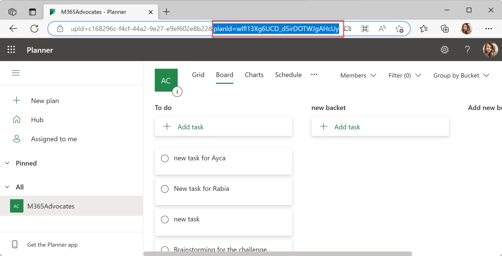

# Getting Started with Developer Assist Dashboard Sample

> Note: We really appreciate your feedback! If you encounter any issue or error, please report issues to us following the [Supporting Guide](./../SUPPORT.md). Meanwhile you can make [recording](https://aka.ms/teamsfx-record) of your journey with our product, they really make the product better. Thank you!
>
> This warning will be removed when the samples are ready for production.

> Important: Please be advised that access tokens are stored in sessionStorage for you by default. This can make it possible for malicious code in your app (or code pasted into a console on your page) to access APIs at the same privilege level as your client application. Please ensure you only request the minimum necessary scopes from your client application, and perform any sensitive operations from server side code that your client has to authenticate with.
Microsoft Teams supports the ability to run web-based UI inside "custom tabs" that users can install either for just themselves (personal tabs) or within a team or group chat context.

Developer Team Dashboard shows you how to build a tab with OpenAI Code Helper, Azure DevOps work items, GitHub issues and Planner tasks to accelerate developer team collaboration and productivity.

## Prerequisites

- [NodeJS](https://nodejs.org/en/), fully tested on NodeJS 14, 16
- An M365 account. If you do not have M365 account, apply one from [M365 developer program](https://developer.microsoft.com/en-us/microsoft-365/dev-program)
- [Teams Toolkit Visual Studio Code Extension](https://aka.ms/teams-toolkit) or [TeamsFx CLI](https://aka.ms/teamsfx-cli)

## What you will learn in this sample:
- How to use TeamsFx to embed a canvas containing multiple cards that provide an overview of data or content in your tab app.
- How to use TeamsFx to build frontend hosting on Azure for your tab app.
- How to use TeamsFx to build backend hosting on Azure for your tab app.
- How to use MS graph client in TeamsFx to get access to M365 data.

## Try the Sample with Visual Studio Code Extension: [TO BE UPDATED]
> Here are the instructions to run the sample in **Visual Studio Code**. You can also try to run the app using TeamsFx CLI tool, refer to [Try the Sample with TeamsFx CLI](cli.md)
1. Clone the repo to your local workspace or directly download the source code.
2. Download [Visual Studio Code](https://code.visualstudio.com) and install [Teams Toolkit Visual Studio Code Extension](https://aka.ms/teams-toolkit).
3. Open the project in Visual Studio Code.

## Configure implemented Features  
Before running this project, make sure to configure integrated features in the Developer Assist Dashboard. Follow the steps to complete the configuration.
### DevOps work items
To integrate DevOps Work Items in the dashboard, follow the instructions:
1. Login to [Azure DevOps](https://dev.azure.com/) and select the project you want to configure in the Developer Assist Dashboard. Copy the `organization name` and `project name` from the project url as shown below:
 
1. In Azure DevOps, select **User settings** and then select **Personal access token**. Select **+ New token** to create a new personal access token, give a name to your token, select **Read** permission for Work Items and **Create**.
 
1. Open **devopsService.ts** file inside `tabs > src > services` folder: 
    * Replace **{OrganizationName}** and **{ProjectName}** with your `organization name` and `project name` inside `https://dev.azure.com/{OrganizationName}/{ProjectName}/_apis/wit/workitems?ids=1,2,3,4,5&api-version=7.0`.
    * Replace `DEVOPS-PERSONAL-ACCESS-TOKEN` with your personal access token.

This widget displays DevOps Work Items including the title, type, assigned to and state of the work item:

### GitHub issues
To integrate GitHub issues in the dashboard, follow the instructions:
1. Login to [GitHub](https://github.com/) and select **Settings > Developer settings > Personal access token**. Select **Generate new token** to create new personal access token. Give a name to your token, select the repositories you want to access. Under `Repository permissions`, give **Read and write** access to **Issues**.
 
1. Open **githubService.ts** file inside `tabs > src > services` folder, inside the both of **GetIssues** and **CreateIssue** functions:
    * Replace `GITHUB-PERSONAL-ACCESS-TOKEN` with your personal access token.
    * Replace `REPOSITORY-OWNER-NAME` with your GitHub username and `REPOSITORY-NAME` with your repository name.

This widget displays GitHub issues including the title, status and the url of the GitHub issue. This widget also includes creating a new issue functionality:

### Planner tasks
To integrate Planner tasks in the dashboard, follow the instructions:
1. Login to [Microsoft Planner](https://tasks.office.com/) and select the plan you want to integrate, copy the **Plan Id** from the URL:
 
1. Open **plannerService.ts** file inside `tabs > src > services` folder, replace `{plan-id}` inside `/planner/plans/{plan-id}/tasks?$top=4` with your plan id.

This widget displays Planner tasks including the title of the task. This widget also includes creating a new task functionality:

### OpenAI Code Helper
To integrate OpenAI Code Helper in the dashboard, follow the instructions:
1. Login to [OpenAI API Keys](https://platform.openai.com/account/api-keys) to create a new API key. Select **Create new secret key** and copy the API key.
1. Open **openAIService.ts** file inside `tabs > src > services` folder, replace `OPEN-API-KEY` with your OpenAI API Key.

This widget displays OpenAI Code Helper that responds user's code related questions with a code snippet:

## Run the sample
Start debugging the project by hitting the `F5` key in Visual Studio Code.

> The first time you run this sample, you need to login to consent some delegated permissions. If you don't see the consent page, please check if your browser blocks the pop-up window.

## Edit the manifest

You can find the Teams manifest in `templates/appPackage` folder. The templates contains:
* `manifest.template.json`: Manifest file for Teams app running locally and remotely.

Both file contains template arguments with `{...}` statements which will be replaced at build time. You may add any extra properties or permissions you require to this file. See the [schema reference](https://docs.microsoft.com/en-us/microsoftteams/platform/resources/schema/manifest-schema) for more.

## Deploy to Azure

Deploy your project to Azure by following these steps:

| From Visual Studio Code                                                                                                                                                                                                                                                                                                                                                                                                                                                                                                 | From TeamsFx CLI                                                                                                                                                                                                                    |
|:------------------------------------------------------------------------------------------------------------------------------------------------------------------------------------------------------------------------------------------------------------------------------------------------------------------------------------------------------------------------------------------------------------------------------------------------------------------------------------------------------------------------|:------------------------------------------------------------------------------------------------------------------------------------------------------------------------------------------------------------------------------------|
| <ul><li>Open Teams Toolkit, and sign into Azure by clicking the `Sign in to Azure` under the `ACCOUNTS` section from sidebar.</li> <li>After you signed in, select a subscription under your account.</li><li>Open the Teams Toolkit and click `Provision in the cloud` from DEPLOYMENT section or open the command palette and select: `Teams: Provision in the cloud`.</li><li>Open the Teams Toolkit and click `Deploy to the cloud` or open the command palette and select: `Teams: Deploy to the cloud`.</li></ul> | <ul> <li>Run command `teamsfx account login azure`.</li> <li>Run command `teamsfx account set --subscription <your-subscription-id>`.</li> <li> Run command `teamsfx provision`.</li> <li>Run command: `teamsfx deploy`. </li></ul> |

> Note: Provisioning and deployment may incur charges to your Azure Subscription.

## Package

- From Visual Studio Code: open the command palette and select `Teams: Zip Teams metadata package`.
- Alternatively, from the command line run `teamsfx package` in the project directory.

## Publish to Teams

Once deployed, you may want to distribute your application to your organization's internal app store in Teams. Your app will be submitted for admin approval.

- From Visual Studio Code: open the Teams Toolkit and click `Publish to Teams` or open the command palette and select: `Teams: Publish to Teams`.
- From TeamsFx CLI: run command `teamsfx publish` in your project directory.

## Architecture

- The frontend is a react tab app hosted on [Azure Storage](https://docs.microsoft.com/en-us/azure/storage/).
- The Backend server is hosted on [Azure Function](https://docs.microsoft.com/en-us/azure/azure-functions/) for managing posts in the tab app.

### Code structure

- You can check app configuration and environment information in: [.fx](.fx)
- You will find frontend code in: [tabs/src/views/widgets](tabs/src/views/widgets)
- You will find backend code in: [tabs/src/services](tabs/src/services)

## Code of Conduct

This project has adopted the [Microsoft Open Source Code of Conduct](https://opensource.microsoft.com/codeofconduct/).

For more information see the [Code of Conduct FAQ](https://opensource.microsoft.com/codeofconduct/faq/) or
contact [opencode@microsoft.com](mailto:opencode@microsoft.com) with any additional questions or comments.